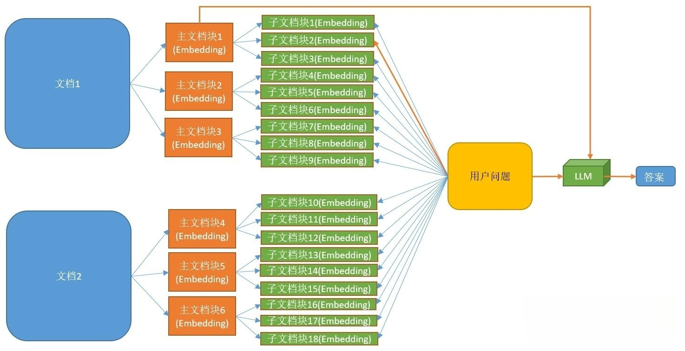

# ParentDocument-RAG


## 介绍
父子文档检索问答系统，基于LLM和向量检索。

主要使用：Langchain+fastapi+qwen2-7b+faiss

## 代码介绍
1. vllm_fastapi.py: 部署qwen2-7b模型
2. sample_chat.py: langchain调用qwen2-72b模型
3. vector_save.py: 通过Langchain的父子文档切片器，将文档切片并保存到faiss中。
4. retrival_industry.py: 检索文档，拼接Ref并调用微调后的qwen2-7b模型进行问答。
5. BCErerank.py: 源代码与pylance不兼容出错，更换本地文件。
6. eval.py: 评估模型效果：ROUGE和BLEU。

## 代码执行
需要根据自己的模型与数据，进行调整
```bash
python vllm_fastapi.py
python sample_chat.py
python vector_save.py
python retrival_industry.py
python eval.py
```
